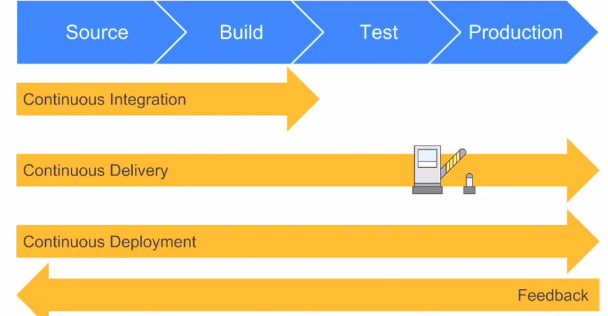

# Ci start code 
SLDC - Software development lifecycle - is a framework to define tasks performed at each step in the software development process
## Three main stages   
### ```Development```
 
### ```Testing``` - Ran tests to fail, fix,
example runnig nginx, past/fail. Until all testing it working under rake spec
integration tests/unit tests and then when all quality assurance, user acceptance testing accepts 
the system when connecting to other users. 
- Load balancer should be implemented when limit has been reached, letting know user limit has been reached before 404 page. 
Product is not given to user on live or client until testing has been implemented 
- Not all the tests has to be automated
- Test stages depends on company: defined unit testing for each line of code. In our case, jenkins will be used.

### ```Deployment (Production Environment)```

## Pre-DevOps Time
Historical was very slow. DevOps was introduced to acquire quick deploymet time, faster testing time. 

## Benefits
- Modernising things 

# Continuous Integration and Continuous Delivery  


## What's difference Continuous Delivery and Continuous Integration
- CI/CD pipeline automates software delivery process 
- The pipeline builds code, run tests (CI), then safely deploys a new version of the application (CD)
- Automated pipeline helps:
    - reduce the need for manual error checks
    - faster integration of new team members, and more productivity because the need to learn complex development and test environment is removed
    - A development team or QA can detect code during feedback loop and reject it 
    - provide visibility and breakdown of code during each successive stage


## CI/CD/CD
- Continuous Integration is a software development practice where developers merge code to a central repository (GitHub)
various times  a day. Implementation of CI avoids merges branches into release branch 


- CDelivery is considered the extension of continuous integration to ensure changes are updated in a sustainable process
- Not only the testing is automated but wiht CD, release process is also automated so deployment can be initiated anytime. 
__In CDelivery the deployment is completed manually__ . 
    - Sends it constant state to be ready for deployment 
	- Ci delivery is after integration and done manually (Node app.js manually) and operates before the release to the client
- CDeployment is considered the extra step beyond continuous delivery, with this practice, every change that passes the 
production pipeline is released customers, __No human intervention is require__ .  
    - is done automated with reverse proxy using just node app.js - only when all tests pass - After release to client 


## What is CI CD pipeline?
CI/CD pipeline refers to automation of numerous processes:
- imitating code builds
- automating testing 
- automating deployment

## Extension of SDLC
Before jenkins, monolith architecture was prolific. This involved completing large projects in huge blocks, committing the code
at the very end, test the final build and deployed. There were many problems with this process, such as a huge idle time between 
development and operations for develops to finish code to check build. Identifying errors and isolating occurrences were difficult. 
Code build and test process were manual and the overall development cycle was slow.

Now, with jenkins, a power tool for developers, give developers the opportunity to have multiple commits a day, deploy the source into server
if the build is successful otherwise, jenkins will notify the errors. Jenkins also gives instant feedback after testing. 
Code is built after each commit and easy to detect. Overall the development cycle fast, and efficient through use of automated build,
test process and save time by reducing errors. 
